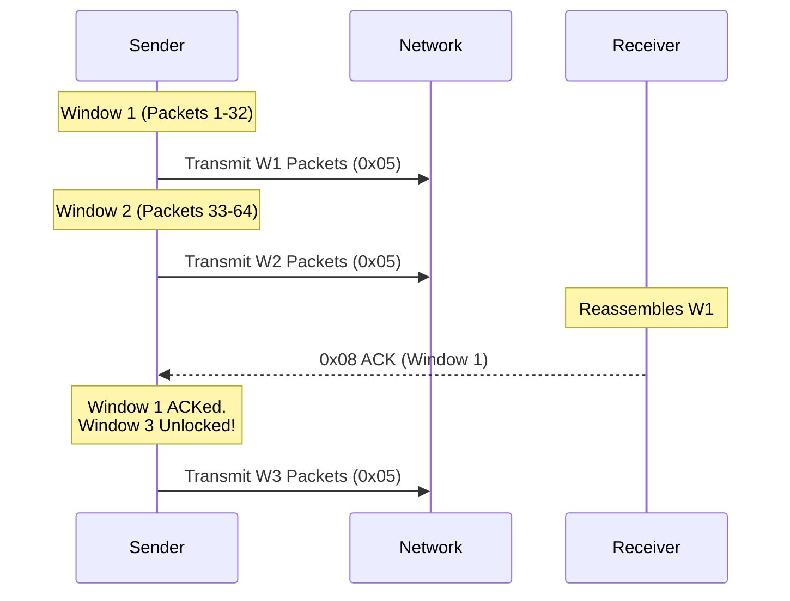
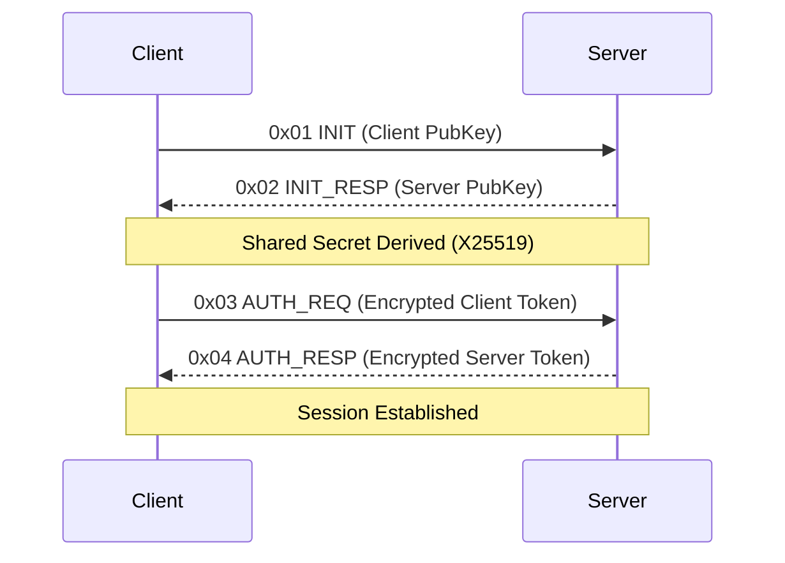

<div align="center">
  <h1>🛡️ S-UDP 🚀</h1>
  <p><b>High-Performance, Secure, Pipelined Sliding Window UDP Engine</b></p>
  
  
  
  
</div>

<br/>

## 🌌 Introduction
**S-UDP (Secure UDP)** is a next-generation transport protocol built in Rust. It bridges the gap between the speed of UDP and the reliability of TCP, wrapping it all in state-of-the-art cryptography. Designed for high-throughput, low-latency environments, S-UDP features a custom 2-window pipelined sliding window architecture, ensuring non-blocking data streams with robust packet loss recovery.

## ✨ Futuristic Features
- 🔐 **Zero-Compromise Security**: X25519 Diffie-Hellman Handshakes and ChaCha20Poly1305 AEAD per-packet encryption.
- 🚀 **2-Window Pipelining**: Send up to two data windows concurrently without waiting for ACKs, minimizing latency.
- 📦 **Smart Gap-Filling**: Granular, per-packet tracking within windows to selectively retransmit only what was lost.
- ⏱️ **Exponential RTO Backoff**: Adaptive Retransmission TimeOut prevents network flooding during congestion.
- 🛡️ **Token Masking (`TokenGuard`)**: Secrets are obfuscated in memory until the exact microsecond they are needed.

---

## ⚙️ Core Architecture & Mechanisms

### The Packet Geometry
Every S-UDP transmission features a unified 25-byte protocol overhead layout:
```text
[ FLAG (1 byte) | SEQUENCE (8 bytes) | PAYLOAD (Variable) | POLY1305 TAG (16 bytes) ]
```

### The S-UDP Flag Ecosystem
| Flag | Name | Purpose |
|------|------|---------|
| `0x01` | **INIT** | Client initiates X25519 key exchange. |
| `0x02` | **INIT_RESP** | Server responds with its public key. |
| `0x03` | **AUTH_REQ** | Client sends encrypted auth token. |
| `0x04` | **AUTH_RESP** | Server validates token and finalizes handshake. |
| `0x05` | **DATA** | Encrypted application payload. |
| `0x06` | **DISCONNECT** | Graceful termination signal. |
| `0x08` | **ACK** | Windowed Acknowledgment for flow control. |

---

## 🔄 The 2-Window Pipelined Sliding Window

S-UDP achieves non-blocking data streaming using a **Pipelined Sliding Window** mechanism. Instead of waiting for an ACK after every packet or single window, the sender can push **two windows** into the network simultaneously.



### Window Sequence (`window_seq`)
The 8-byte `SEQUENCE` field in a DATA packet (`0x05`) is bit-packed:
- **Bits 7+**: The `window_idx` (Which window this packet belongs to).
- **Bits 2-6**: The `packet_pos` (0 to 31, representing the packet's position in the 32-packet window).
- **Bit 1**: `end_window` flag (Indicates the final packet of a window).
- **Bit 0**: `end_stream` flag (Indicates the final packet of the entire stream).

### Gap-Filling & Retransmission
1. **Buffering**: The receiver buffers incoming packets into a `HashMap` keyed by `window_idx`.
2. **Missing Detection**: When the `end_window` packet arrives (or a timeout occurs), the receiver checks for missing `packet_pos` indices.
3. **Selective ACKing**: The receiver sends an `0x08 ACK` containing a bitmap of missing packets.
4. **Resend**: The sender only retransmits the precise packets missing from that window, backing off exponentially (`RTO`) if the network is congested.

---

## 🤝 Cryptographic Handshake Workflow

S-UDP utilizes a **Unified 50ms Gated Handshake** to prevent replay attacks and SYN floods.



---

## 🛠️ Usage Example

```rust
use s_udp::Engine;

#[tokio::main]
async fn main() {
    // Server setup
    let mut server_engine = Engine::new();
    server_engine.listen("0.0.0.0:5001", "CLIENT_SECRET".into(), "SERVER_SECRET".into()).await.unwrap();

    // Client setup
    let mut client_engine = Engine::new();
    client_engine.connect("127.0.0.1:5001", 0, "CLIENT_SECRET".into(), "SERVER_SECRET".into()).await.unwrap();

    // Transmit Data
    client_engine.send_data(b"Hello from S-UDP!").await.unwrap();
}
```

---
<div align="center">
  <p><i>Engineered for the Future of Secure Data Transport.</i></p>
</div>
