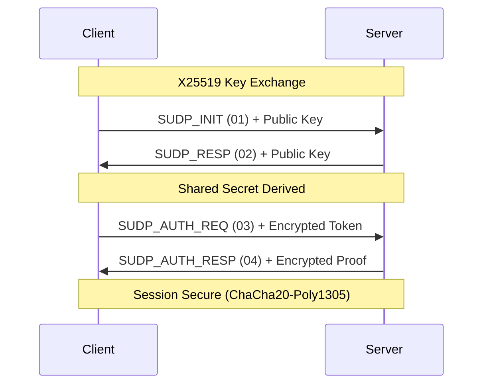

# 🚀 S-UDP: Smart User Datagram Protocol

[](https://www.rust-lang.org)
[](https://crates.io/crates/s-udp)
[](https://opensource.org/licenses/MIT)
[](#security)

**S-UDP** is a high-performance, cryptographically secure, and ultra-adaptive reliability layer built on top of UDP. Designed for high-throughput streams and unstable networks, S-UDP combines the speed of UDP with the intelligence of modern congestion control.

---

## 💎 Key Innovations

### 📈 Accelerated Adaptive Windowing
S-UDP doesn't just send data; it learns your network.
- **Exponential Growth**: Successive full windows trigger an acceleration multiplier ($32 \times n$), reaching the **2048-packet** capacity in seconds.
- **Proportional Shrink**: Unlike TCP's aggressive half-cuts, S-UDP shrinks its window size **linearly based on actual loss percentage**, maintaining maximum possible throughput.

### 🛡️ Cryptographic Integrity
Every single byte is shielded by **ChaCha20-Poly1305**.
- **Unique Nonce Schema**: A sophisticated 64-bit sequence mapping ensures zero nonce reuse across Data and ACK packets.
- **Forward Secrecy**: Ephemeral X25519 key exchange for every session.

### ⏱️ Dynamic RTO Calibration
- **Zero-Wait Handshake**: RTO estimation begins during the very first packet exchange (INIT/RESP).
- **Fine-Grained Sampling**: Retransmission timers adapt at the sub-millisecond level based on real-time network jitter.

---

## 🗺️ Protocol Architecture

### The 64-Bit Sequence Mapping
S-UDP uses a highly optimized bit-packed header for maximum efficiency:

| Bits | Purpose | Description |
| :--- | :--- | :--- |
| **63** | `DIR` | Direction Bit (Client/Server separation) |
| **13–62** | `WINDOW_IDX` | 50-bit Window Index (Long-lived sessions) |
| **2–12** | `PACKET_IDX` | 11-bit Packet Index (0–2047 per window) |
| **1** | `END_W` | End of Window Flag |
| **0** | `END_S` | End of Stream Flag |

### Handshake & Session Establishment


---

## 🛠️ Security & DoS Protection

S-UDP is built to survive in hostile environments:
- **Rate-Limited Initiation**: IPs are limited to 3 handshakes per minute.
- **Exponential Penalty**: Auth failures trigger a 3min -> 6min -> 12min ... 24h block.
- **Stateless Rejection**: Invalid flags or failed Poly1305 tags are dropped instantly with zero CPU overhead.

---

## 🚀 Performance Benchmarks

| Feature | S-UDP | Standard UDP | Legacy Reliable UDP |
| :--- | :--- | :--- | :--- |
| **Max Window** | **2048 Packets** | N/A | 32 - 128 Packets |
| **Congestion Control** | **Adaptive Proportional** | None | Static / AIMD |
| **Encryption** | **Built-in (Poly1305)** | None | Optional / External |
| **ACK Overhead** | **Adaptive Bitmask** | None | High (Cumulative) |

---

## 💻 Getting Started

```rust
use s_udp::{Engine, Event};

#[tokio::main]
async fn main() -> Result<(), Box<dyn std::error::Error>> {
    let engine = Engine::new();
    
    // Start a secure listener
    let mut rx = engine.listen("0.0.0.0:5001", "my_secret_token".into(), "server_token".into()).await?;
    
    while let Some(event) = rx.recv().await {
        match event {
            Event::Data(report) => println!("Received {} bytes via S-UDP!", report.total_bytes),
            _ => {}
        }
    }
    Ok(())
}
```

---

## 📜 License
Distributed under the MIT License. See `LICENSE` for more information.

---
*Built with ❤️ by the S-UDP Community.*
